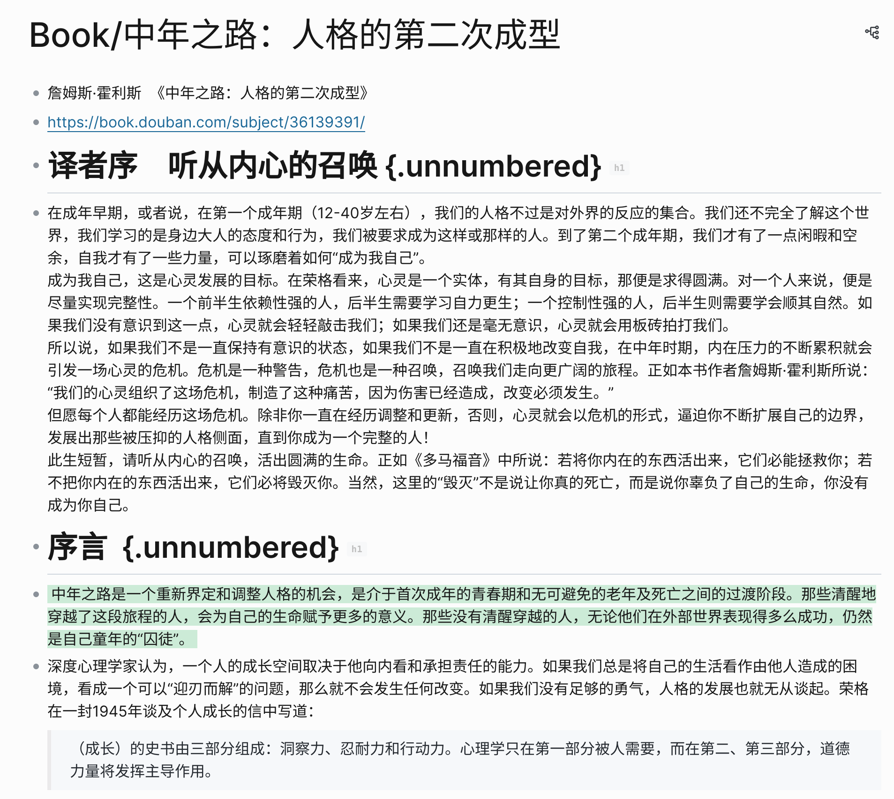
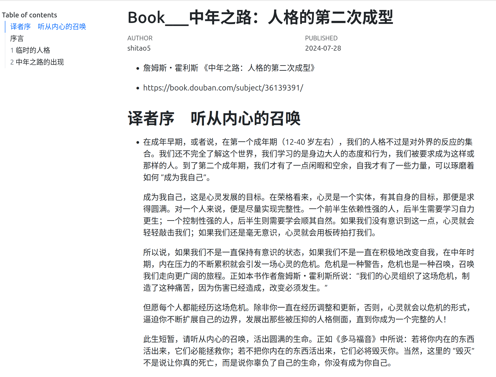
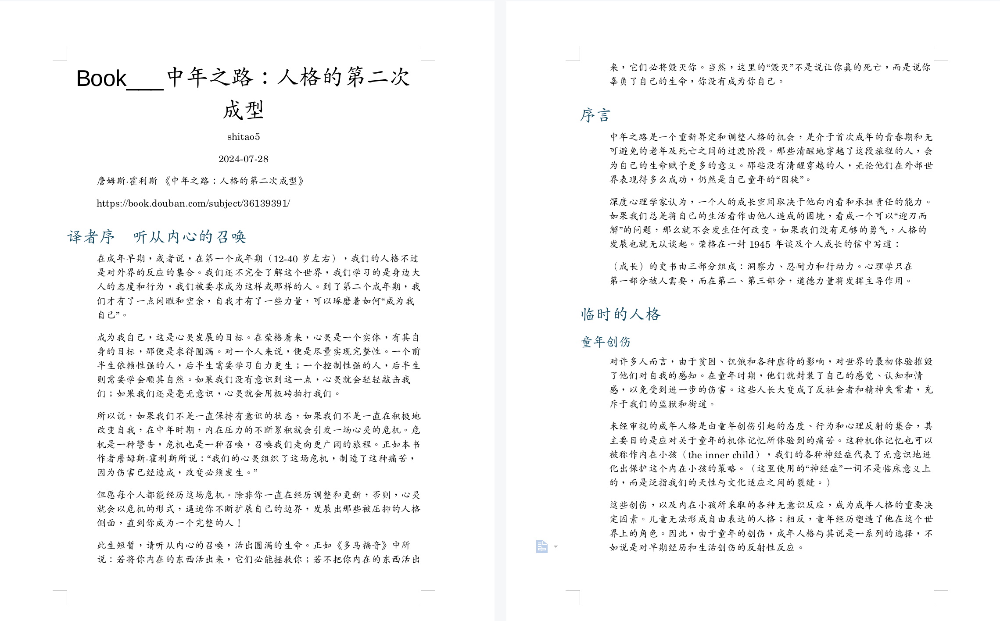

# Logseq-markdown-output

Logseq 目录下的 Markdown 文件不美观，尤其是标题前面带有无序编号（`-`）。为了方便共享 Logseq 笔记页面，写了这个 Shiny 应用。功能比较简单：

1.  使用 [Quarto](https://quarto.org/) 将 Logseq Markdown 文件转为 HTML 或 Docx；
2.  可自定义标题（默认为文件名）、作者、日期（默认为系统日期）。除后缀外，文件名默认与上传的 Markdown 文件名相同。

## 效果展示

Logseq 页面：

输出 HTML：

输出 Docx：

